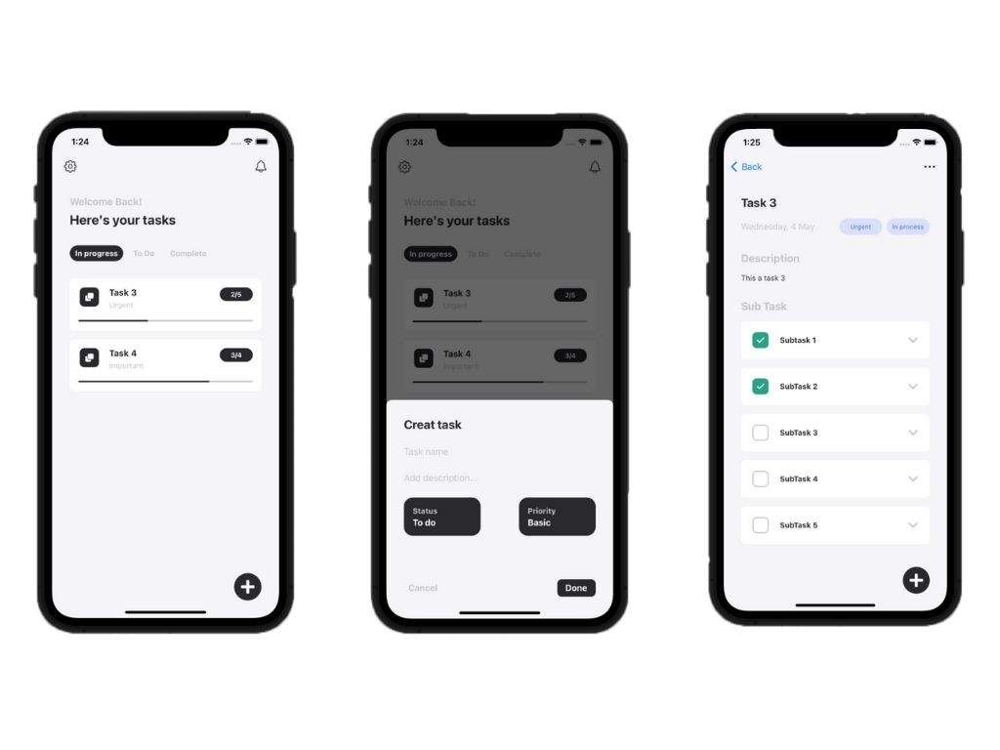

 

  <h3 align="center">Task List</h3>

  

    App para organização de tarefas
  

  
Índice

      <a href="#sobre-o-projeto">Sobre o projeto</a>
      <ul>
        <li><a href="#construido-com">Construido com</a></li>
      </ul>
    </li>
    <li><a href="#contato">Contato</a></li>
  </ol>

## Sobre o projeto

O aplicativo permite a criação de tarefas e subtarefas, tendo assim, uma maior organização. Também há uma persistência de dados local, utilizando o User Default.

### Construído com

O projeto foi construído utilizando:

- [Swift](https://www.swift.org/)

## Contato

William James - william.james.pj@gmail.com

Link do projeto: [https://github.com/william-james-pj/Pokedex-iOS](https://github.com/william-james-pj/Pokedex-iOS)
